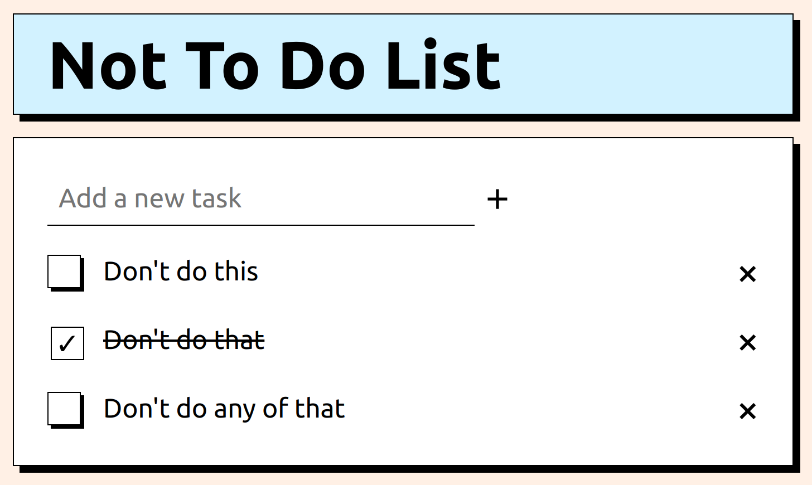

# Not To Do List

Stack

### Frontend
- HTMX
### Backend
- Go
### Server environment
- Railway

 

[Not To Do List](https://not-to-do-list-production.up.railway.app/) is an app built with Go + HTMX and hosted on [Railway](https://railway.app/) server.

  

